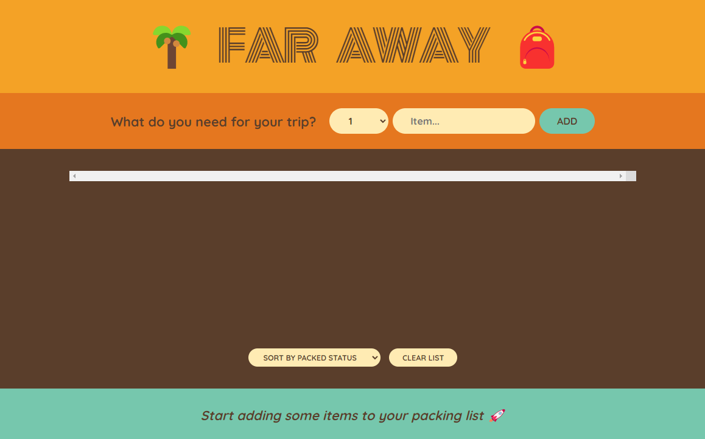
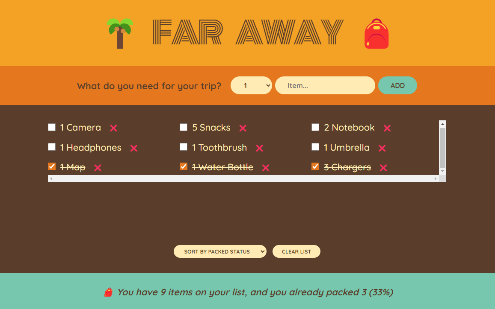
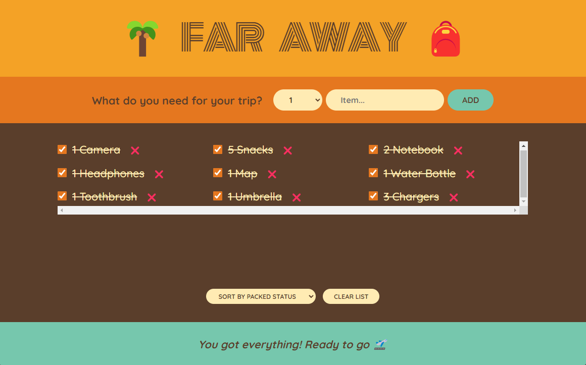
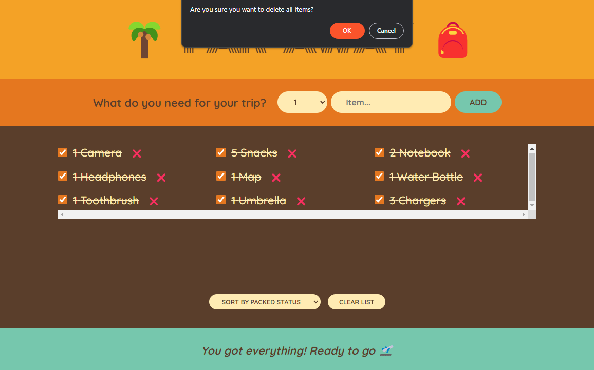

 # Project Title: React Packing List App

# Description: 
React Packing List App is a responsive and user-friendly web application that allows users to create, edit, and delete a list of items for their upcoming trip. It offers a sleek and modern design with various features, including a responsive interface, item categorization, sorting, and a clear option for an easy start. The application utilizes React.js and Bootstrap for the frontend and Node.js with Express for the backend.

# Key Features

**1. User-friendly Interface:** React-Packing-List-App provides a user-friendly interface that is easy to navigate and use.

**2. Responsive Design:** The application's responsive design ensures that it functions effectively on various devices and screen sizes.

**3. Item Categorization:** Users can categorize their items into different categories based on their trip needs, such as Toiletries, Electronics, and Clothing.

**4. Packing List Stats:** The application displays statistics related to the items on the list, including the total number of items, items already packed, and a percentage representation.

**5. Sorting Option:** Users can sort their items in the list based on the input order, which allows them to maintain a logical and organized list.

**6. Clear List Option:** The application offers a clear list option that allows users to delete all items from the list at once, making it easy to start over.

**7. Progressive Web App (PWA):** React-Packing-List-App is a PWA, meaning it can be installed on a user's device and function offline.

## Getting Started

**1.** Clone the repository using the following command:

    git clone git@github.com:McACE007/React-Packing-List-App.git

**2.** Install the required dependencies by running the following command in your terminal:

    npm install

**3.** Start the development server by running the following command:

    npm run dev

**4.** Open your preferred web browser and navigate to  `http://localhost:3000`. You will now have access to the React Packing List App.

**5.** When you are ready to deploy, simply run the following command to create a production-ready build:

    npm run build

To begin exploring the React Packing List App, simply visit the  [live demo]()  and navigate through the user-friendly app. The app is also compatible with various modern web browsers, including Google Chrome, Firefox, Safari, and Microsoft Edge.

# 📸 Screenshots

| Home Page | Few Items Packed |
|------|-------|
|||

| Sort By Input Order | Sort By Description |
|------|-------|
|||

| Sort By Packed Status | All Items Packed |
|------|-------|
|||

| Clear All Items Confirmation |
|------|
||
